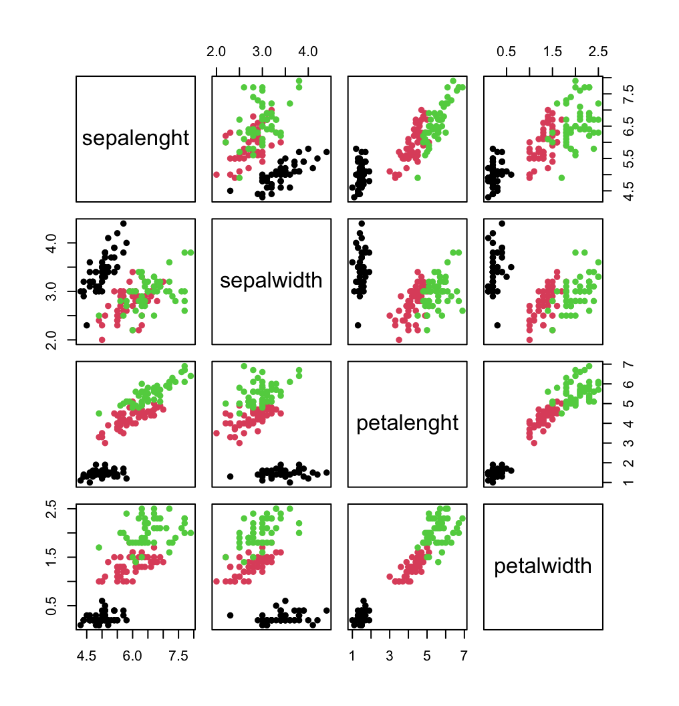

# Iris Project 🌸

Welcome to the Iris Project! ✨ This project is a part of the **Statistical Inference Methods** course (Politecnico di Milano, year 2022/2023), where we dive into the iconic *Iris dataset* to uncover insights using various statistical techniques. Along the way, you'll see data preprocessing, stunning visualizations, linear regression, logistic regression for classification, and how to evaluate our models. Let's get into the fun of analyzing data!


## Project Structure 📁

Here’s how everything is organized in the project:

- `data`: Contains the Iris dataset (iris.data.txt) and any other essential data files used in the analysis.

- `anaconda_projects`: This folder holds the following Jupyter notebooks:

    - **`01_data_preprocessing.ipynb`**: Clean, transform, and prepare the dataset.
    - **`02_visualization.ipynb`**: Visualize the dataset and explore relationships between features.
    - **`03_linear_model.ipynb`**: Build a linear regression model to predict based on the data.
    - **`04_logistic_regression.ipynb`**: Perform binary classification using logistic regression (guess who the Iris-versicolor
    is!).
    - **`05_prediction_analysis.ipynb`**: Evaluate how well our model performs on test data.

- `results`:

    - `plots`: Contains graphical representations and plots generated during the analysis, including:

        - `Boxplots, pair plots, and ggpairs`: To explore the structure of the dataset and examine the relationships between variables.
        - `Correlation plots`: To better understand the strength and direction of relationships among variables.
        - `QQ plots`: To assess the normality of residuals in various models.
        - `Confusion matrix heatmaps`: Providing a detailed visualization of classification performance, including true positives, true negatives, false positives, and false negatives.
        - `ROC curve`: Illustrating the trade-off between sensitivity and specificity, aiding in the selection of an optimal classification threshold.

    - `tables`: Contains output files with results from the analysis, such as model summaries and statistical tests (e.g., Shapiro-Wilk test), saved in text format. Examples: m1.txt, m2.txt, m3.txt, ..., m8.txt.
    
- `README.md`: Provides an overview of the project, including its purpose, methodology, and how to run the analysis.


## What You’ll Need 🔧

To run this project and explore the Jupyter notebooks with an R kernel, you’ll need to have a few tools installed on your system:

### Software Dependencies

1. **R**: The R programming language must be installed. Get it from the [official R website](https://cran.r-project.org/mirrors.html).
2. **Jupyter Notebook**: To run the notebooks, you'll need Jupyter Notebook with the R Kernel.

You can install Jupyter using pip:

```
pip install notebook
```

Then, install the R kernel for Jupyter by following the steps here:  
https://irkernel.github.io/installation/

### Cloning the Repository

Ready to dive in? Start by cloning the repository to your local machine with this command:

```
git clone https://github.com/elisabettatea/iris-project.git
```


Once you've cloned the repository, navigate to the project folder:

```
cd iris-project
```

### Running Jupyter Notebook

To run the notebooks, just start the Jupyter Notebook server by running:

```
jupyter notebook
```

This will open the Jupyter Notebook interface in your browser, and you're ready to explore the data and models!


## What You’ll Learn 💡

In this project, we’ll take a deep dive into the Iris dataset using the following techniques:

- **Data Preprocessing**: Clean up the dataset, handle missing values, and ensure the data is in the right shape for modeling.
- **Data Visualization**: Create beautiful visualizations (think scatter plots, pair plots) to uncover hidden patterns.
- **Linear Regression**: Build a linear model to understand the relationship between the features and predict outcomes.
- **Logistic Regression**: Apply logistic regression for binary classification (Is it Iris-versicolor or not?).
- **Model Evaluation**: Evaluate how well our models are doing using various statistical tests and performance metrics.

## Results 📊

### 01-Data Preprocessing

The first step in the analysis involved data preprocessing. The dataset structure was reviewed to understand its features, types, and relationships.

```
'data.frame':	150 obs. of  5 variables:
 $ sepalenght: num  5.1 4.9 4.7 4.6 5 5.4 4.6 5 4.4 4.9 ...
 $ sepalwidth: num  3.5 3 3.2 3.1 3.6 3.9 3.4 3.4 2.9 3.1 ...
 $ petalenght: num  1.4 1.4 1.3 1.5 1.4 1.7 1.4 1.5 1.4 1.5 ...
 $ petalwidth: num  0.2 0.2 0.2 0.2 0.2 0.4 0.3 0.2 0.2 0.1 ...
 $ class     : chr  "Iris-setosa" "Iris-setosa" "Iris-setosa" "Iris-setosa" ...

 NAs = 0
```

A summary of the dataset, including key statistics like means and ranges for numeric variables, was provided in data-summary.txt. 

```
   sepalenght      sepalwidth      petalenght      petalwidth       class          
 Min.   :4.300   Min.   :2.000   Min.   :1.000   Min.   :0.100   Length:150        
 1st Qu.:5.100   1st Qu.:2.800   1st Qu.:1.600   1st Qu.:0.300   Class :character  
 Median :5.800   Median :3.000   Median :4.350   Median :1.300   Mode  :character  
 Mean   :5.843   Mean   :3.054   Mean   :3.759   Mean   :1.199                     
 3rd Qu.:6.400   3rd Qu.:3.300   3rd Qu.:5.100   3rd Qu.:1.800                     
 Max.   :7.900   Max.   :4.400   Max.   :6.900   Max.   :2.500                     

```

This helped in identifying any data quality issues such as missing values or outliers. We can see that there are no missing values.

### 02-Visualization

To better understand the dataset, several visualizations were created:

- **Correlation Plots**: The 02-corrplot-num.png and 02-corrplot-col.png files show how features relate to each other, helping us understand multicollinearity and which features might be useful for modeling.

| Correlation  (colours)                            | Correlation (numeric)                             |
| --------------------------------------------------| --------------------------------------------------| 
|  |  | 

- **Boxplots and Pair Plots**: The boxplot.png and 02-pairs.png visualizations were used to check for outliers and to visually inspect the relationships between different features.


| Pairs                                             | GGpairs                                         | Boxplot                          | 
| --------------------------------------------------| ------------------------------------------------|--------------------------------------------| 
|             |      |  | 


- **Class vs Features**: The 02-class vs plot helps visualize how the target class is distributed across different features, guiding feature selection for modeling.


| Class vs petal lenght                                  |Class vs petal width                                   |Class vs sepal lenght                                  |Class vs sepal width                                  |
| ------------------------------------------------------ | ------------------------------------------------------|-------------------------------------------------------|-------------------------------------------------------| 
|   |  |  |  |


### 03-Linear Model

    The modeling process progressed through several stages of refinement. Initially, a simple linear model was built, and then interaction terms were added to capture more complex relationships. Outliers and influential points were systematically removed based on leverage, Cook’s distance, and standardized and studentized residuals. Afterward, covariate selection methods such as stepwise regression were used to optimize the model, and a manual adjustment was made to finalize the model.

    Through these steps, the model improved progressively from R2= 0.9285 to R2=0.959, demonstrating a more accurate and robust fit. The final model is considered a very good fit for predicting the class variable based on the other measurements in the iris.data dataset.

#### Linear Model 1: Initial Linear Regression (m1)

The first model (m1) is a simple linear regression that predicts the class variable based on all other variables in the dataset.

```
Coefficients:
            Estimate Std. Error t value Pr(>|t|)    
(Intercept)  1.19208    0.20470   5.824 3.57e-08 ***
sl          -0.10974    0.05776  -1.900 0.059418 .  
sw          -0.04424    0.05996  -0.738 0.461832    
pl           0.22700    0.05699   3.983 0.000107 ***
pw           0.60989    0.09447   6.456 1.52e-09 ***
---
Signif. codes:  0 ‘***’ 0.001 ‘**’ 0.01 ‘*’ 0.05 ‘.’ 0.1 ‘ ’ 1

Residual standard error: 0.2191 on 145 degrees of freedom
Multiple R-squared:  0.9304,	Adjusted R-squared:  0.9285 
F-statistic: 484.8 on 4 and 145 DF,  p-value: < 2.2e-16

	Shapiro-Wilk normality test

data:  residuals(m1)
W = 0.991, p-value = 0.4589
```

The summary of the model (summary(m1)) shows the coefficients and performance metrics: R2=0.9285
The Shapiro-Wilk test (shapiro.test(residuals(m1))) is performed to test the normality of the residuals. The p-value is 0.4589, which suggests that the residuals follow a normal distribution, supporting the linear regression assumptions.

#### Linear Model 2: Adding Interaction Terms (m2)

In this step, we add interaction terms (sl*sw and pl*pw) to the model in order to explore potential relationships between predictors that might improve the model fit.

R2 increases to 0.9343, and the p-value decreases to 0.105, suggesting a better fit, but still not very significant.

A QQ plot is generated for the residuals (qqnorm(m2$residuals)) to visually check for normality. While the plot does not suggest severe issues, some outliers are apparent.

 

After this, we make some attempts to understand which technique suits the best for our analysis. We check:
- Leverage points
- Cook's distance
- Standardized residuals
- Studentized residuals

#### Linear Model 3: Removing Leverage Points (m3)

Leverage points can disproportionately influence the model's fit. These are identified using hatvalues(m2) and removed from the dataset if their leverage exceeds a threshold (2 * rank/n).

After removing high-leverage points, the model (m3) is re-fitted, and the summary shows the effect of these points on the model. Residual analysis continues to ensure the model assumptions hold.

#### Linear Model 4:  Removing Points with High Cook’s Distance (m4)

Cook's distance is used to identify influential data points that significantly affect the regression coefficients. Points with Cook's distance above a threshold (4/(n-p-1)) are removed from the second model(m2).

The updated model (m4) is fitted, and residuals are checked to ensure the model assumptions still hold.

#### Linear Model 5: Removing Points with Standardized Residuals Greater than 2 (m5)

In this step, we remove points with standardized residuals greater than 2, which indicates large residuals relative to the standard deviation of the residuals.

The model (m5) is re-fitted, and the results show an improved fit with R2=0.9678, but the p-value is still high at 0.08855.

A QQ plot is also generated for the residuals (qqnorm(m5$residuals)) to visually check for normality.

 

#### Linear Model 6: Removing Points with Studentized Residuals Greater than 2 (m6)

These residuals are scaled by an estimate of their standard deviation. Points with studentized residuals greater than 2 are considered outliers and are removed.

#### Comparing m3, m4, m5 , m6

Model summary and Shapiro-Wilk test results are saved to m3.txt, m4.txt, m.5.txt, m6.txt.

Here, a summary:

|     | R2 | p-value |
|----------|----------|----------|
| m3 | 0.9466  | 0.0002334 |
| m4 | 0.9511  | 9.218e-05 |
| m5 | 0.9678  | 0.08855 |
| m6 | 0.942  | 0.0008003|

From the above table is clear that the best model is m5, which holds both the R2 and the p-value to be the highest ones.

#### Linear Model 7: Stepwise Covariate Selection (m7)

I decide to continue my analysis on the 5th model, and at this point I start selecting the covariates that I want to keep.

The step() function is used to select covariates automatically. This method iteratively adds or removes predictors to find the best model based on AIC (Akaike Information Criterion).

```

Coefficients:
            Estimate Std. Error t value Pr(>|t|)    
(Intercept)  4.80373    1.19325   4.026 9.20e-05 ***
sl          -0.90098    0.23810  -3.784 0.000227 ***
sw          -1.11696    0.39349  -2.839 0.005196 ** 
pl           0.17909    0.05238   3.419 0.000820 ***
pw           1.46012    0.29304   4.983 1.80e-06 ***
sl:sw        0.24590    0.07739   3.178 0.001823 ** 
pl:pw        0.10438    0.02125   4.912 2.45e-06 ***
sw:pw       -0.43305    0.09133  -4.741 5.11e-06 ***
---
Signif. codes:  0 ‘***’ 0.001 ‘**’ 0.01 ‘*’ 0.05 ‘.’ 0.1 ‘ ’ 1

Residual standard error: 0.1958 on 142 degrees of freedom
Multiple R-squared:  0.9456,	Adjusted R-squared:  0.9429 
F-statistic: 352.5 on 7 and 142 DF,  p-value: < 2.2e-16


	Shapiro-Wilk normality test

data:  residuals(m7)
W = 0.96695, p-value = 0.001132
```

Although this model has a relatively good fit and statistical significance, it doesn't perform as well as earlier models (such as Model 5) in terms of predictive accuracy (R2=0.9678). However, it still offers an improvement over simpler models, with a high level of statistical confidence.

#### Linear Model 8: Model after Manual Covariate Removal (m8)

After the stepwise selection, the covariate pw is manually removed due to its higher estimate, which doesn't add significant value to the model.

```

Coefficients:
             Estimate Std. Error t value Pr(>|t|)    
(Intercept)  2.046963   1.141911   1.793 0.075155 .  
sl          -0.204285   0.208160  -0.981 0.328060    
sw          -0.141926   0.368729  -0.385 0.700879    
pl           0.223017   0.055767   3.999 0.000102 ***
sl:sw        0.006906   0.065596   0.105 0.916296    
pl:pw        0.121649   0.022644   5.372 3.08e-07 ***
sw:pw       -0.024205   0.043327  -0.559 0.577277    
---
Signif. codes:  0 ‘***’ 0.001 ‘**’ 0.01 ‘*’ 0.05 ‘.’ 0.1 ‘ ’ 1

Residual standard error: 0.2114 on 143 degrees of freedom
Multiple R-squared:  0.9361,	Adjusted R-squared:  0.9334 
F-statistic:   349 on 6 and 143 DF,  p-value: < 2.2e-16


	Shapiro-Wilk normality test

data:  residuals(m8)
W = 0.98312, p-value = 0.06299
```

Although this model has a slightly lower R2 than Model 7, it still represents a reasonably good fit. The higher p-value suggests that the model is not as strong as some of the earlier models, and the removal of pw might have led to a slight reduction in the model's explanatory power.


### 04-Logistic Regression

In this workflow, we'll go step by step to build and evaluate a logistic regression model to predict whether a flower belongs to the class Iris-versicolor using the Iris dataset. We'll cover data preparation, model fitting, evaluation, and diagnostics.


Before building our model, we need to prepare the data. The iris dataset contains three flower classes, but we’re only interested in predicting Iris-versicolor vs. Iris-virginica.

We create a binary target variable (class_binaria), where Iris-versicolor is coded as 1, and all other flowers are coded as 0.

To assess how well our model generalizes, we split the data into training (70%) and testing sets(30%).

#### Logistic Model 1: Initial Logistic Regression 

Now, we fit our first logistic regression model to predict the binary class using sl, sw, pl, and pw as predictors.


```
Coefficients:
            Estimate Std. Error z value Pr(>|z|)  
(Intercept)   42.638     25.707   1.659   0.0972 .
sl             2.465      2.394   1.030   0.3032  
sw             6.681      4.480   1.491   0.1359  
pl            -9.429      4.737  -1.991   0.0465 *
pw           -18.286      9.743  -1.877   0.0605 .
---
Signif. codes:  0 ‘***’ 0.001 ‘**’ 0.01 ‘*’ 0.05 ‘.’ 0.1 ‘ ’ 1

(Dispersion parameter for binomial family taken to be 1)

    Null deviance: 138.629  on 99  degrees of freedom
Residual deviance:  11.899  on 95  degrees of freedom
AIC: 21.899

Number of Fisher Scoring iterations: 10
```

#### Logistic Model 2: Improvement by Removing Insignificant Predictors

We proceed by refining the model by removing the predictors with higher p-values to reduce complexity and possibly improve the model's predictive performance.

Here, we removed sl (sepal length) from the model because its p-value (0.3032) was not significant, making it a less useful predictor.

```

Coefficients:
            Estimate Std. Error z value Pr(>|z|)  
(Intercept)   50.527     23.995   2.106   0.0352 *
sw             8.376      4.761   1.759   0.0785 .
pl            -7.875      3.841  -2.050   0.0403 *
pw           -21.430     10.707  -2.001   0.0453 *
---
Signif. codes:  0 ‘***’ 0.001 ‘**’ 0.01 ‘*’ 0.05 ‘.’ 0.1 ‘ ’ 1

(Dispersion parameter for binomial family taken to be 1)

    Null deviance: 138.629  on 99  degrees of freedom
Residual deviance:  13.266  on 96  degrees of freedom
AIC: 21.266

Number of Fisher Scoring iterations: 10
```

#### Model comparison

The lower AIC for Model 2 suggests that removing the less significant predictor (sl) improved the model by reducing its complexity without significantly hurting its fit.

Although Model 1 has a lower residual deviance, indicating it fits the data slightly better, the difference is marginal. Model 2 sacrifices a little fit (slightly higher residual deviance) but benefits from a better AIC, meaning it is likely a more generalizable model that avoids overfitting.

Conclusion: Model 2 should be preferred over Model 1 because it is more parsimonious (fewer predictors) and has a better AIC, despite a slightly higher residual deviance. This suggests that Model 2 is more efficient, avoiding overfitting while still capturing important relationships in the data.

#### ANOVA 

We use the ANOVA function to compare the two models (model2 vs. model) and check if removing sl led to a significant improvement.

```
Model 1: class_binaria ~ sw + pl + pw
Model 2: class_binaria ~ sl + sw + pl + pw
  Resid. Df Resid. Dev Df Deviance Pr(>Chi)
1        96     13.266                     
2        95     11.899  1   1.3673   0.2423

```

The ANOVA results show that adding the sl (sepal length) variable to Model 2 doesn't really improve the model in a meaningful way. The p-value of 0.2423 suggests that the change in fit is not significant enough to justify adding sl. So, Model 1 (class_binaria ~ sw + pl + pw) is just as good as Model 2 (class_binaria ~ sl + sw + pl + pw) but simpler.


#### GOF

We perform a GOF (Goodness of Fit) test on the first model. The result of the Hoslem-test returned a p-value of 0.9995, indicating that Model 1 fits the data very well. This p-value is much greater than 0.05, so we can conclude that the model does not have significant misfit issues.

#### Residuals

Finally, we analyze the residuals of Model 1 to assess if there are any patterns that could indicate problems with the model.

 

This plot helps us check if the residuals are randomly scattered around zero, which is a good indication that the model's assumptions hold. If there are patterns in the residuals, it might suggest that the model is missing important features or interactions.


### 05-Prediction Analysis


## Questions? 

If you have any questions, feel free to reach out! You can contact me at:  

✉️ **elisabetta.tea@gmail.com**

Happy coding and analyzing! ✨
