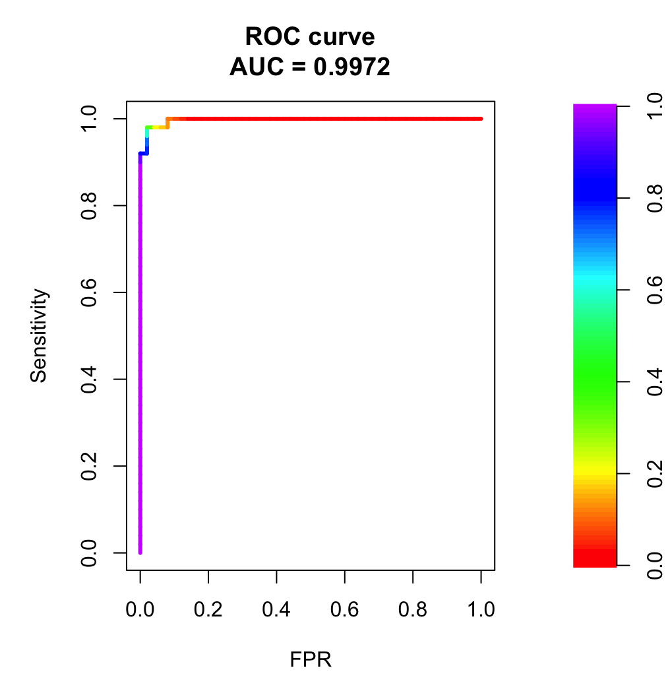

# Iris Project 🌸

Welcome to the Iris Project! ✨ This project is a part of the **Statistical Inference Methods** course (Politecnico di Milano, year 2022/2023), where we dive into the iconic ***Iris dataset*** to uncover insights using various statistical techniques. Along the way, you'll see data preprocessing, stunning visualizations, linear regression, logistic regression for classification, and how to evaluate our models. Let's get into the fun of analyzing data!

<div align="center">


</div>

## Project Structure 📁

Here’s how everything is organized in the project:

- `data`: Contains the Iris dataset (iris.data.txt) and any other essential data files used in the analysis.

- `anaconda_projects`: This folder holds the following Jupyter notebooks:

    - **`01_data_preprocessing.ipynb`**: Clean, transform, and prepare the dataset.
    - **`02_visualization.ipynb`**: Visualize the dataset and explore relationships between features.
    - **`03_linear_model.ipynb`**: Build a linear regression model to predict based on the data.
    - **`04_logistic_regression.ipynb`**: Perform binary classification using logistic regression (guess who the Versicolor
    is!).
    - **`05_prediction_analysis.ipynb`**: Evaluate how well our model can predict outcomes on new data.

- `results`:

    - `plots`: Contains graphical representations and plots generated during the analysis, including:

        - `Boxplots, pair plots, and ggpairs`: To explore the structure of the dataset and examine the relationships between variables.
        - `Correlation plots`: To better understand the strength and direction of relationships among variables.
        - `QQ plots`: To assess the normality of residuals in various models.
        - `Confusion matrix heatmaps`: Providing a detailed visualization of classification performance, including true positives, true negatives, false positives, and false negatives.
        - `ROC curve`: Illustrating the trade-off between sensitivity and specificity, aiding in the selection of an optimal classification threshold.

    - `tables`: Contains output files with results from the analysis, such as model summaries and statistical tests (e.g., Shapiro-Wilk test), saved in text format. Examples: m1.txt, m2.txt, m3.txt, ..., m8.txt.
    
- `README.md`: Provides an overview of the project, including its purpose, methodology, and how to run the analysis.


## What You’ll Need 🔧

To run this project and explore the Jupyter notebooks with an R kernel, you’ll need to have a few tools installed on your system:

### Software Dependencies

1. **R**: The R programming language must be installed. Get it from the [official R website](https://cran.r-project.org/mirrors.html).
2. **Jupyter Notebook**: To run the notebooks, you'll need Jupyter Notebook with the R Kernel.

You can install Jupyter using pip:

```
pip install notebook
```

Then, install the R kernel for Jupyter by following the steps here:  
https://irkernel.github.io/installation/

### Cloning the Repository

Ready to dive in? Start by cloning the repository to your local machine with this command:

```
git clone https://github.com/elisabettatea/iris-project.git
```


Once you've cloned the repository, navigate to the project folder:

```
cd iris-project
```

### Running Jupyter Notebook

To run the notebooks, just start the Jupyter Notebook server by running:

```
jupyter notebook
```

This will open the Jupyter Notebook interface in your browser, and you're ready to explore the data and models!


## What You’ll Learn 💡

In this project, we’ll take a deep dive into the Iris dataset using the following techniques:

- **Data Preprocessing**: Explore the dataset's structure, verify its integrity, and ensure the data is ready for modeling without requiring additional cleaning or handling of missing values.
- **Data Visualization**: Create beautiful visualizations (think scatter plots, pair plots) to uncover hidden patterns.
- **Linear Regression**: Build a linear model to understand the relationship between the features and predict outcomes.
- **Logistic Regression**: Apply logistic regression for binary classification (Is it a Versicolor or not?).
- **Model Evaluation**: Evaluate how well our models performs on test data doing using various statistical tests and performance metrics.

## Techniques & Results 📊

### 01-Data Preprocessing

The journey begins with diving into the raw dataset! The first step of our analysis was all about understanding the data—exploring its structure, features, and relationships to set the foundation for building powerful models. This crucial phase was like uncovering the blueprint for the insights that would follow!

```
'data.frame':	150 obs. of  5 variables:
 $ sepalenght: num  5.1 4.9 4.7 4.6 5 5.4 4.6 5 4.4 4.9 ...
 $ sepalwidth: num  3.5 3 3.2 3.1 3.6 3.9 3.4 3.4 2.9 3.1 ...
 $ petalenght: num  1.4 1.4 1.3 1.5 1.4 1.7 1.4 1.5 1.4 1.5 ...
 $ petalwidth: num  0.2 0.2 0.2 0.2 0.2 0.4 0.3 0.2 0.2 0.1 ...
 $ class     : chr  "Iris-setosa" "Iris-setosa" "Iris-setosa" "Iris-setosa" ...

 NAs = 0
```
We learn that the dataset contains 150 observations and 5 variables: sepal length, sepal width, petal length, petal width, and class. There are no missing values, and the class variable represents flower species.

A summary of the dataset, including key statistics like means and ranges for numeric variables, was provided in data-summary.txt. 

```
   sepalenght      sepalwidth      petalenght      petalwidth       class          
 Min.   :4.300   Min.   :2.000   Min.   :1.000   Min.   :0.100   Length:150        
 1st Qu.:5.100   1st Qu.:2.800   1st Qu.:1.600   1st Qu.:0.300   Class :character  
 Median :5.800   Median :3.000   Median :4.350   Median :1.300   Mode  :character  
 Mean   :5.843   Mean   :3.054   Mean   :3.759   Mean   :1.199                     
 3rd Qu.:6.400   3rd Qu.:3.300   3rd Qu.:5.100   3rd Qu.:1.800                     
 Max.   :7.900   Max.   :4.400   Max.   :6.900   Max.   :2.500                     

```

The dataset summary provides key statistics: minimum, first quartile, median, mean, third quartile, and maximum values for numeric variables (sepal length, sepal width, petal length, and petal width). 

We also notice that the class variable is categorical. Later on, it will be converted into a numeric format for better handling in the analysis. This transformation allows the model to interpret the class labels as binary values, making the data more suitable for statistical and machine learning techniques.

### 02-Visualization

To further understand the dataset, several visualizations were created:

- **Correlation Plots**: 

    The correlation plots suggest how features relate to each other, helping us understand multicollinearity and which features might be useful for modeling. 
    Correlation values range from -1 to 1. A value of 1 indicates a perfect positive relationship, -1 indicates a perfect negative relationship, and 0 means no relationship.

<div align="center">

| Correlation  (colours)                            | Correlation (numeric)                             |
| --------------------------------------------------| --------------------------------------------------| 
|  |   | 

</div>


- **Boxplots and Pair Plots**: 

    - The `pairs` plot shows scatterplots for each pair of features, helping visualize relationships between Sepal and Petal dimensions. Diagonal histograms display individual feature distributions, while off-diagonal plots reveal correlations and separations between species
    - The `ggpairs` plot enhances the pairs plot by adding more details, including correlation coefficients and customized plots. It allows a deeper understanding of pairwise feature correlations, providing additional context for interpreting variable interactions across different Iris species.
    - The `boxplot` compares the distribution of the sepal and petal measurements across species. The minimum and maximum values (excluding outliers) are represented by the whiskers. The median (middle value) is the line inside the box. The upper and lower quartiles (Q1 and Q3) define the box edges. Outliers are points outside the whiskers. highlighting the median, range, and any outliers (). These visualizations are important for understanding the structure and separation of the data, which aids in model interpretation.


| Pairs                                             | GGpairs                                         | Boxplot                          | 
| --------------------------------------------------| ------------------------------------------------|--------------------------------------------| 
|             |      |  | 

</div>

- **Class vs Features**: 
    
    These four plots display the relationship between the Iris species (class) and each feature (pl, pw, sl, sw). Each plot uses different colors and point shapes for species, helping visualize how each feature separates or overlaps the species categories.


<div align="center">

| Class vs petal lenght                                  |Class vs petal width                                   |Class vs sepal lenght                                  |Class vs sepal width                                  |
| ------------------------------------------------------ | ------------------------------------------------------|-------------------------------------------------------|-------------------------------------------------------| 
|   |  |  |  |

</div>

### 03-Linear Model

We started with an initial model to predict class based on all four variables. Then, we introduced interaction terms between some variables to explore more complex relationships. Next, we used four methods to improve the model by removing outliers and influential data points: leverage, Cook's distance, standardized residuals, and studentized residuals. We found that the best model was the one based on standardized residuals. Afterward, we applied advanced covariate selection techniques like stepwise regression to fine-tune the model, followed by a final round of manual adjustments to ensure an optimized and robust result.

<div align="center">
 
</div>


`💡` **IDEA**: To evaluate the model, we used two key metrics: (adjusted) R-squared and the p-value from the Shapiro-Wilk test on residuals. Adjusted R-squared shows how well the model explains the data, while the Shapiro-Wilk test checks if the residuals follow a normal distribution. These metrics ensure the model is both accurate and reliable. By focusing on these indicators, we can confirm the model's effectiveness in making predictions and its statistical validity. This approach also helps us ensure that the underlying assumptions of the model are met.

Through these steps, the model improved progressively from R<sup>2</sup> = 0.9285 to R<sup>2</sup> = 0.9609, demonstrating a more accurate and robust fit. The final model is considered a very good fit for predicting the class variable based on the other measurements in the iris.data dataset.

#### Linear Model 1: Initial Linear Regression (m1)

The first model (m1) is a simple linear regression that predicts the class variable based on all other variables in the dataset.

```
Coefficients:
            Estimate Std. Error t value Pr(>|t|)    
(Intercept)  1.19208    0.20470   5.824 3.57e-08 ***
sl          -0.10974    0.05776  -1.900 0.059418 .  
sw          -0.04424    0.05996  -0.738 0.461832    
pl           0.22700    0.05699   3.983 0.000107 ***
pw           0.60989    0.09447   6.456 1.52e-09 ***
---
Signif. codes:  0 ‘***’ 0.001 ‘**’ 0.01 ‘*’ 0.05 ‘.’ 0.1 ‘ ’ 1

Residual standard error: 0.2191 on 145 degrees of freedom
Multiple R-squared:  0.9304,	Adjusted R-squared:  0.9285 
F-statistic: 484.8 on 4 and 145 DF,  p-value: < 2.2e-16

	Shapiro-Wilk normality test

data:  residuals(m1)
W = 0.991, p-value = 0.4589

```

The summary of the model (summary(m1)) provides coefficients and performance metrics, showing R<sup>2</sup> = 0.9285. The Shapiro-Wilk test (shapiro.test(residuals(m1))) assesses the normality of residuals. With a p-value of 0.4589, the residuals appear to follow a normal distribution, supporting the assumptions of linear regression.

#### Linear Model 2: Adding Interaction Terms (m2)

In this step, interaction terms (sl* sw and pl*pw) are included to explore potential relationships between predictors that might enhance the model's performance.

R<sup>2</sup> improves to 0.9343, and the p-value decreases to 0.105. While this indicates a better model fit, the improvement is not highly significant.

A QQ plot is generated for the residuals (qqnorm(m2$residuals)) to visually check for normality. While the plot does not suggest severe issues, some outliers are apparent.

<div align="center">
 
</div>


Next, we explored various techniques to identify the most suitable approach for our analysis. Specifically, we examined:

- Leverage points
- Cook's distance
- Standardized residuals
- Studentized residuals

These are four different approaches used to identify and remove problematic data points from the analysis.

#### Linear Model 3: Removing Leverage Points (m3)

Leverage points can disproportionately influence the model's fit. These are identified using hatvalues(m2) and removed from the dataset if their leverage exceeds a threshold (2 * rank/n).

After removing high-leverage points, the model (m3) is fitted, and the summary shows the effect of these points on the model. Residual analysis continues to ensure the model assumptions hold.

#### Linear Model 4:  Removing Points with High Cook’s Distance (m4)

Cook's distance is used to identify influential data points that significantly affect the regression coefficients. Points with Cook's distance above a threshold (4/(n-p-1)) are removed from the second model(m2).

The updated model (m4) is fitted, and residuals are checked to ensure the model assumptions still hold.

#### Linear Model 5: Removing Points with Standardized Residuals Greater than 2 (m5)

In this step, we remove points with standardized residuals greater than 2, which indicates large residuals relative to the standard deviation of the residuals.

The model (m5) is fitted, and the results show an improved fit with R<sup>2</sup>=0.9678, but the p-value is still high at 0.08855.

A QQ plot is also generated for the residuals (qqnorm(m5$residuals)) to visually check for normality.


<div align="center">
 
</div>


#### Linear Model 6: Removing Points with Studentized Residuals Greater than 2 (m6)

These residuals are scaled by an estimate of their standard deviation. Points with studentized residuals greater than 2 are considered outliers and are removed.

#### Comparing m3, m4, m5 , m6

Model summary and Shapiro-Wilk test results are saved to m3.txt, m4.txt, m.5.txt, m6.txt.

Here, a summary:

|     | R<sup>2</sup> | p-value (SW test) |
|----------|----------|----------|
| m3 | 0.9445  | 0.0002322 |
| m4 | 0.9576   | 0.0001245 |
| m5 | 0.9678   | 0.08855 |
| m6 | 0.9679   | 0.03578|


From the table above, model `m5` appears to be the best compromise. It achieves a high R<sup>2</sup> value (0.9678), indicating excellent explanatory power, while also maintaining a reasonably high p-value in the Shapiro-Wilk test (0.08855), suggesting that residuals are sufficiently close to normality.


#### Linear Model 7: Stepwise Covariate Selection (m7)

I chose to move forward with the 5th model, as it strikes the ideal balance between explanatory power and residual normality. At this stage, I began refining the model by carefully selecting the covariates to retain.

The step() function is used to select covariates automatically. This method iteratively adds or removes predictors to find the best model based on AIC (Akaike Information Criterion).

AIC measures the trade-off between model complexity and goodness of fit—lower values indicate a better model with fewer unnecessary variables.

```
Coefficients:
            Estimate Std. Error t value Pr(>|t|)    
(Intercept)  4.21752    0.92544   4.557 1.19e-05 ***
sl          -0.74086    0.18681  -3.966 0.000121 ***
sw          -0.94772    0.30198  -3.138 0.002106 ** 
pl           0.12061    0.04140   2.913 0.004216 ** 
pw           1.30114    0.22682   5.736 6.53e-08 ***
sl:sw        0.20480    0.05979   3.425 0.000824 ***
pl:pw        0.12355    0.01685   7.333 2.20e-11 ***
sw:pw       -0.39044    0.07170  -5.446 2.51e-07 ***
---
Signif. codes:  0 ‘***’ 0.001 ‘**’ 0.01 ‘*’ 0.05 ‘.’ 0.1 ‘ ’ 1

Residual standard error: 0.1436 on 129 degrees of freedom
Multiple R-squared:  0.9702,	Adjusted R-squared:  0.9686 
F-statistic: 600.3 on 7 and 129 DF,  p-value: < 2.2e-16
	Shapiro-Wilk normality test

data:  residuals(m7)
W = 0.98063, p-value = 0.04859
```

This model outperforms earlier ones, such as Model 5, with a slightly higher R<sup>2</sup> (0.9686) and statistical significance (p-value = 0.04859). Its advantage lies in explaining the data more effectively while using fewer predictors, making it more efficient and robust.


#### Linear Model 8: Model after Manual Covariate Removal (m8)

After the stepwise selection, I manually removed the covariate pw. 

```
Coefficients:
            Estimate Std. Error t value Pr(>|t|)    
(Intercept)  1.55949    0.89401   1.744 0.083458 .  
sl          -0.08348    0.16465  -0.507 0.612995    
sw          -0.03568    0.28652  -0.125 0.901079    
pl           0.15713    0.04565   3.442 0.000777 ***
sl:sw       -0.01554    0.05114  -0.304 0.761767    
pl:pw        0.13673    0.01863   7.341 2.06e-11 ***
sw:pw       -0.02390    0.03630  -0.658 0.511431    
---
Signif. codes:  0 ‘***’ 0.001 ‘**’ 0.01 ‘*’ 0.05 ‘.’ 0.1 ‘ ’ 1

Residual standard error: 0.1602 on 130 degrees of freedom
Multiple R-squared:  0.9626,	Adjusted R-squared:  0.9609 
F-statistic: 557.9 on 6 and 130 DF,  p-value: < 2.2e-16
	Shapiro-Wilk normality test

data:  residuals(m8)
W = 0.98709, p-value = 0.2284
```

This adjustment improved the normality of the residuals, though it led to a slight decrease in R<sup>2</sup>. Whether this small drop in R<sup>2</sup> is acceptable for cleaner residuals is ultimately a subjective decision, depending on the priority you place on model fit versus residual behavior.

**RESULTS**: The journey from **m1** to **m8** was a process of constant refinement. Starting with a simple model, we explored interactions, tackled outliers, and fine-tuned covariates. Each step revealed deeper insights, ultimately leading to a more precise, balanced model—showing how small changes can significantly enhance performance and residuals.


### 04-Logistic Regression

In this workflow, I’ll walk you through building and evaluating a logistic regression model to predict whether a flower belongs to the Iris-versicolor class using the Iris dataset. 

Unlike linear regression, which predicts continuous values, logistic regression estimates probabilities for categorical outcomes, making it ideal for classification tasks. We'll cover data preparation, model fitting, evaluation, and diagnostics.

Before building the model, I prepared the data. The Iris dataset includes three flower classes, but the focus here is predicting if a flower is an Iris-versicolor. I created a binary target variable (`class_binaria`), assigning 1 to Iris-versicolor and 0 to all other classes.

Then, to see how well our model performs, we split the data into training (70%) and testing sets (30%).

#### Logistic Model 1: Initial Logistic Regression 

Now, we fit our first logistic regression model to predict the binary class using sl, sw, pl, and pw as predictors.


```
Coefficients:
            Estimate Std. Error z value Pr(>|z|)  
(Intercept)   42.638     25.707   1.659   0.0972 .
sl             2.465      2.394   1.030   0.3032  
sw             6.681      4.480   1.491   0.1359  
pl            -9.429      4.737  -1.991   0.0465 *
pw           -18.286      9.743  -1.877   0.0605 .
---
Signif. codes:  0 ‘***’ 0.001 ‘**’ 0.01 ‘*’ 0.05 ‘.’ 0.1 ‘ ’ 1

(Dispersion parameter for binomial family taken to be 1)

    Null deviance: 138.629  on 99  degrees of freedom
Residual deviance:  11.899  on 95  degrees of freedom
AIC: 21.899

Number of Fisher Scoring iterations: 10
```

#### Logistic Model 2: Improvement by Removing Insignificant Predictors

The model is refined by removing predictors with higher p-values, aiming to simplify it and reduce complexity while maintaining or potentially improving its predictive performance.

Here, we removed sl (sepal length) from the model because its p-value (0.3032) indicates it is not significantly associated with the target variable. Removing it simplifies the model, focusing on predictors with stronger contributions.

```
Coefficients:
            Estimate Std. Error z value Pr(>|z|)  
(Intercept)   50.527     23.995   2.106   0.0352 *
sw             8.376      4.761   1.759   0.0785 .
pl            -7.875      3.841  -2.050   0.0403 *
pw           -21.430     10.707  -2.001   0.0453 *
---
Signif. codes:  0 ‘***’ 0.001 ‘**’ 0.01 ‘*’ 0.05 ‘.’ 0.1 ‘ ’ 1

(Dispersion parameter for binomial family taken to be 1)

    Null deviance: 138.629  on 99  degrees of freedom
Residual deviance:  13.266  on 96  degrees of freedom
AIC: 21.266

Number of Fisher Scoring iterations: 10
```

#### Model comparison

The lower AIC for Model 2 suggests that removing the less significant predictor (sl) improved the model by reducing its complexity without significantly hurting its fit.

Although Model 1 has a lower residual deviance, indicating it fits the data slightly better, the difference is marginal. Model 2 sacrifices a little fit (slightly higher residual deviance) but benefits from a better AIC, meaning it is likely a more generalizable model that avoids overfitting.

Conclusion: Model 2 should be preferred over Model 1 because it is more parsimonious (fewer predictors) and has a better AIC, despite a slightly higher residual deviance. This suggests that Model 2 is more efficient, avoiding overfitting while still capturing important relationships in the data.

#### ANOVA 

We use the ANOVA function to compare the two models (model2 vs. model) and check if removing *sl* made a real difference. ANOVA is a statistical method that helps us see if the change between models is important or just random (by evaluating whether the reduction in deviance between models is statistically meaningful).

```
Model 1 (model) : class_binaria ~ sl + sw + pl + pw
Model 2 (model2): class_binaria ~ sw + pl + pw
  Resid. Df Resid. Dev Df Deviance Pr(>Chi)
1        95     11.899                     
2        96     13.266 -1  -1.3673   0.2423


```

The Analysis of Deviance results indicate that removing the sl (sepal length) variable from the first model does not significantly worsen the model. The p-value of 0.2423 suggests that the change in deviance is not substantial enough to justify keeping sl in the model. Therefore, model2 (class_binaria ~ sw + pl + pw) is just as effective as the first one (class_binaria ~ sl + sw + pl + pw) while being simpler and more parsimonious.

This means we can make our predictions just as accurately without complicating things unnecessarily.

#### GOF

We perform a GOF (Goodness of Fit) test on the second model. The result of the Hoslem-test returned a p-value of 0.984, indicating that model2 fits the data very well. This p-value is much greater than 0.05, so we can conclude that the model does not have significant misfit issues.

#### Residuals

Finally, we analyze the residuals of model2 to assess if there are any patterns that could indicate problems with the model.

<div align="center">
 
</div>

From the graph, we can see that the residuals are mostly clustered around zero, which suggests that the model is generally fitting well. However, there are still a few outliers, indicating that some data points are not perfectly captured by the model.

### 05-Prediction Analysis

After building and improving the models, we move on to check how well they predict results. We’ll look at the confusion matrix to see how accurate the predictions are and the ROC curve to understand the model’s ability to correctly identify each class across different settings.

#### Setting a threeshold

The first step is choosing a threshold to determine how predicted probabilities are classified as either class 1 or class 0. This threshold helps decide at what point a predicted probability is considered to belong to one class or the other. In this case, a threshold of 0.1 is chosen to classify predictions.

This means that if the model predicts a probability greater than 0.1, we classify it as class 1 (Iris-versicolor); otherwise, it’s class 0 (not Iris-versicolor). Keep in mind that the goal is to choose a threshold that minimizes misclassification error!

#### Confusion matrix

A confusion matrix is generated to compare the predicted values (valori.predetti) with the actual values (valori.reali). This matrix is essential for evaluating the model’s performance.

<div align="center">
 
</div>

As you can see, the confusion matrix summarizes correct (True Positive, True Negative) and incorrect (False Positive, False Negative) classification outcomes.

It is visualized as a heatmap, and it provides a clear visual representation of the actual versus predicted values and it shows how many times each combination (TP, TN, FP, FN) occurs.

#### Sensitivity and specificity

Various performance metrics are calculated based on this confusion matrix, and they all help us evaluate the model’s performance:

- **Accuracy**: measures the overall correctness of the model.
- **Misclassification Rate**: indicates the error rate of the model.
- **Sensitivity**: (true positive rate): measures how well the model identifies positive instances.
- **Specificity**: (false positive rate): shows how well the model identifies negative instances.

`❔` **QUESTION**: How do we know if the threeshold we set at 0.1 is actually the best one (the one which minimizes error)?

The threshold was chosen arbitrarily at 0.1, but remember that the goal is to minimize the misclassification error! This can be done by experimenting with different thresholds and evaluating the performance metrics at each threshold. 

In particular, we evaluate this using a tool called an ROC curve.

The ROC (Receiver Operating Characteristic) curve shows the trade-off between the true positive rate (sensitivity) and the false positive rate (1 - specificity) at various threshold values.

<div align="center">
 
</div>

- `ROC Curve`: The plot visualizes the model’s performance across different thresholds. The closer the curve is to the top-left corner, the better the model.
- `AUC` (Area Under the Curve): The area under the ROC curve is a measure of the model’s overall performance. The closer the AUC is to 1 , the better the performance.

An **AUC of 0.9972** is excellent, as it means our model is almost perfect at distinguishing between the classes! With such a high AUC, the model is doing a great job of identifying the positive and negative instances, with very few errors. It's a strong indicator that the model has high predictive power.

The threshold of 0.1 seems to strike a good balance, ensuring the model is sensitive enough to correctly identify positive instances while maintaining specificity.

Overall, this threshold appears to be a solid choice for optimizing the model's performance.

## We made it! 🎉🎉

We've successfully navigated every step of this comprehensive analysis, from data preprocessing and model building to evaluation and predictive analysis! It's been an exciting journey, and we've explored a variety of techniques to better understand and predict the Iris dataset. I truly hope you found this process insightful and engaging, and that it sparked curiosity about the power of data analysis and machine learning!

## Questions? 

If you have any questions, feel free to reach out! You can contact me at:  

✉️ **elisabetta.tea@gmail.com**

Happy coding and analyzing! ✨
